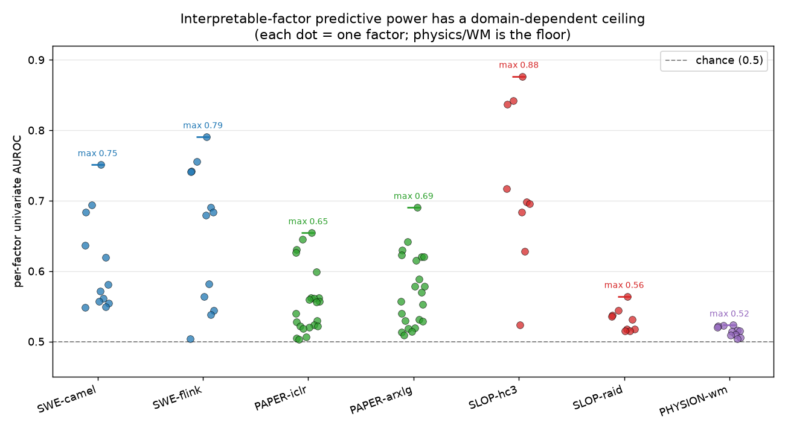
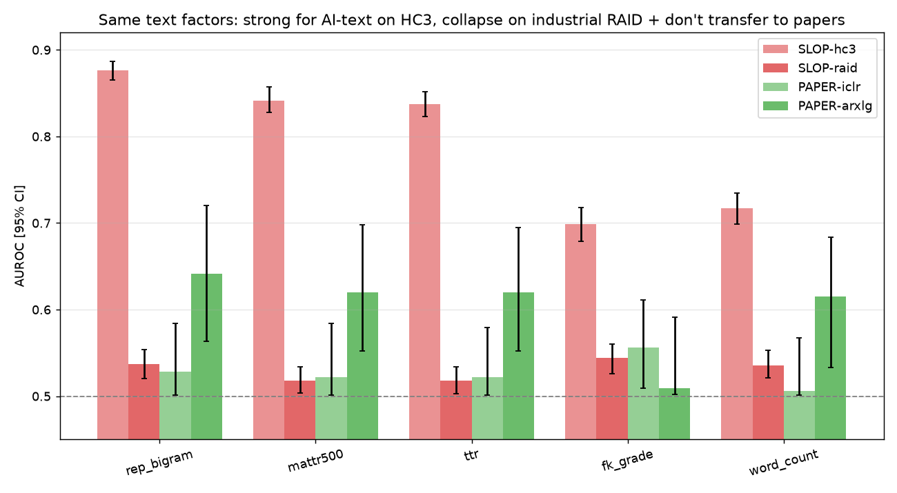
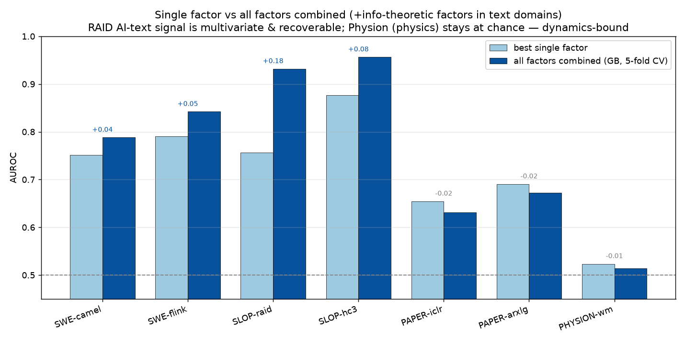

+++
title = "Cheap factors, four domains: a scorecard — and why 'no single factor works' isn't 'no signal'"
date = 2026-06-29
description = "We put interpretable, locally-computable factors from four mechanistically-different domains — software-defect prediction, paper acceptance, AI-text detection, and a world-model physics proxy — on one shared per-factor scorecard. Predictive power has a domain-dependent ceiling, the factors don't transfer across domains, and a single-factor reading nearly had us call an industrial benchmark a 'collapse' when the signal was just multivariate."
authors = ["Kit Kyo · A2O Labs"]

[taxonomies]
tags = ["evaluation", "interpretable-factors", "ai-text-detection", "world-models", "deployability-eval", "negative-result"]

[extra]
show_author = true
+++

A lot of machine-learning practice rests on a quiet assumption: that a handful of cheap, interpretable
features — lines of code changed, a paper's reference count, text repetition, the geometry of a physical
scene — carry real predictive signal about the thing you care about. Sometimes they do. Often they don't.
And the honest answer is **domain-specific, dataset-specific, and depends on whether you look at one factor
or several at once** — three axes that single-number leaderboards quietly collapse.

So we built a small, neutral instrument: a **cross-domain factor scorecard**. Pick a domain with a binary
outcome, compute a set of interpretable factors locally, and score each factor on the same axes —
univariate AUROC (with bootstrap CIs), mutual information, decorrelation, and selection stability
([Nogueira et al., JMLR 2018](https://jmlr.org/papers/v18/17-514.html)). No model under test, no API, runs
on a laptop. Then put four mechanistically-different domains through the same instrument and see what holds.

The four domains:

- **Software defects** — ApacheJIT (~106K real Apache commits, two repos: Camel and Flink), factors =
  just-in-time change metrics (lines added, files touched, change entropy, developer experience), label =
  commit induces a later bug-fix.
- **Paper acceptance** — PeerRead (ICLR 2017 + arXiv.cs.LG), factors = structure (references, sections,
  theorem/equation counts, readability), label = accepted/rejected.
- **AI-text detection** — a balanced subset of RAID (the reference benchmark, drawn across its 11 generators)
  and HC3 (a single 2022-ChatGPT corpus), factors = stylometric (repetition, lexical diversity, readability),
  label = AI vs human.
- **World-model physics (proxy)** — Physion's object-contact prediction. The physical-state files are
  33–389 GB, so we used the 270 MB stimulus set and pulled **crude geometric/kinematic readouts via HSV
  color-masks on early frames** of the 'redyellow' renders (the agent is red, the target yellow). This
  bounds what *our shallow proxy* sees, not what richer physical-state factors could.

## Finding 1: the ceiling is domain-dependent

The single most predictive interpretable factor, per domain:

| domain | best single-factor AUROC |
|---|---|
| Software defects — ApacheJIT Camel / Flink | **0.75 / 0.79** |
| Paper acceptance — PeerRead ICLR / arXiv-LG | 0.65 / 0.69 |
| AI-text on HC3 (stylometric) | 0.88 |
| AI-text on RAID (stylometric only) | ≤ 0.56 |
| World-model physics — Physion (our color-mask proxy) | **0.52 — barely above chance** |

Code-change factors genuinely predict bugs; a paper's structure weakly predicts acceptance; and our physics
proxy sits on the floor. About that floor: even the most physically-meaningful factor we could extract —
whether the agent's early velocity points *at* the target — stays at chance (0.51), and a label-shuffle null
sits at 0.45. We're careful here: our color-mask readouts are deliberately shallow, so this bounds *our
proxy*, not physics in general. But it lines up with Physion's own thesis — contact depends on the full
physical evolution (collisions, chains, rolling) that no early-frame readout captures — and is consistent
with the hypothesis that this is a domain where you need a dynamics model, not cheap features.

## Finding 2: the text factors we tested don't transfer

The text factors that work for AI-text detection (repetition, lexical diversity, readability) are exactly
the kind of thing you might hope is "general." In our tests they aren't. Text repetition scores 0.88
separating AI from human on HC3, but **0.53 — chance, with a CI touching 0.5 — separating accepted from
rejected ICLR papers.** (On arXiv-LG it retains a little, 0.64; the transfer is poor, not literally zero.)

Each domain's predictive signal lives mostly in its *own* native factors: code metrics for defects, document
structure for papers, stylometry for AI-text. On the evidence here, predictive power behaves less like a
property of a factor and more like a property of (factor × domain) — a conjecture this scorecard is built to
keep testing, not a proven law.

## Finding 3: the mistake — "no single factor works" is not "no signal"

Here's where the scorecard caught us reading the data wrong, which is the part worth keeping.

On HC3 — a single old generator — one stylometric factor (text repetition) separates AI from human at 0.88.
On **RAID**, the industrial benchmark spanning 11 generators, every single stylometric factor drops to
≤ 0.56, near chance. The tempting conclusion, and the one we first wrote down: *the stylometric signal is an
easy-benchmark artifact that vanishes on diverse data.*

That conclusion is wrong. Combine the same stylometric factors with a 5-fold cross-validated
gradient-boosting model and RAID jumps from a best-single of 0.56 to a combined **0.91** (fold sd 0.06; a
label-shuffle null sits at 0.47, so it isn't leakage).

The signal didn't vanish — it became **multivariate**. Different generators have different fingerprints
(some repetitive, some low-diversity, some verbose), so no single factor catches all of them, but the
combination does. Two controls keep this honest. Physion, run through the same test, stays at 0.51 combined
(null 0.45) — there the signal really is absent, not hidden. And **paper acceptance does *not* combine**:
arXiv-LG's best single is 0.69 and the combined model is 0.67 — combining doesn't rescue a genuinely
low-signal domain. So the complementarity axis cleanly separates regimes: *multivariate and recoverable*
(RAID), *genuinely absent* (Physion), *one factor already captures it* (defects), and *no combination helps*
(papers).

The lesson is a measurement discipline, not a result: **report per-factor AND multivariate scores.** A
univariate-only scorecard mis-reads distributed signal as collapse.

## Finding 4: stylometric "AI detection" looks more like alignment detection

Decomposing RAID by generator turned up a sharper version of the same story. The stylometric factors look
less like detectors of *machine generation* and more like detectors of the **RLHF / chat-tuned register**.
They catch chat-tuned models (llama-chat, mpt-chat) and miss raw base models (gpt2, mpt, mistral). The
cleanest single piece of evidence is a controlled pair: `mpt` (base) vs `mpt-chat` (same base model, plus
chat-tuning) — lexical-diversity detectability goes from 0.50 to 0.85. This is one matched pair (the broader
base-vs-chat split, mean ~0.54 vs ~0.71, also confounds model family and era), so read it as *consistent
with* chat-tuning rather than raw generation driving detectability — not proof — but it's a clean signal.

It also persists into 2026 models. We generated a small fresh set of human-vs-Claude-Opus-4.8 answers; the
low-lexical-diversity signature is still clearly present (diversity AUROC 0.88), not trained out. The
fingerprint shifts (2022-ChatGPT is repetition-heavy; Claude is diversity-low-but-not-repetitive). Big
caveat, because it matters: n = 112, single domain, and our generation prompt shapes the model's style — so
this is indicative, and not comparable in magnitude across datasets.

## Finding 5: no universal factor — but information theory beats hand-crafting on hard data

Is there *any* factor that predicts across domains? We tried modality-agnostic information-theoretic ones —
gzip-compressibility, byte-entropy — computed identically on the text. There isn't a universal one, and the
way it fails is instructive: gzip-compressibility catches HC3 (0.85 — old ChatGPT is repetitive, so it
compresses) but not RAID; byte-entropy catches RAID (0.76) but not HC3. Each "universal" factor is itself
dataset-specific. (Defects and physics share no raw text representation with these at all, so across
modalities a single universal factor isn't even definable.)

The useful by-product: byte-entropy, a three-line information-theoretic factor, is a far better *single*
detector on industrial RAID (0.76) than any hand-crafted stylometric feature (≤ 0.56). Folding the
information-theoretic factors into the text factor set lifts RAID's single-factor ceiling 0.56 → 0.76 and
its combined ceiling 0.91 → 0.93. On the hard, diverse benchmark, a generic information-theoretic factor
out-predicts the bespoke ones.

## Takeaways

1. **Predictive power is domain-, dataset-, and arity-specific.** A factor's AUROC means little without
   saying *which domain, which dataset, and one-factor-or-many.* Single-number leaderboards hide all three.
2. **Report per-factor AND multivariate.** A univariate-only view reads multivariate signal as "collapse" —
   the mistake this scorecard caught on an industrial benchmark.
3. **There is no universal interpretable factor here**, and our shallow physics proxy is the one place cheap
   factors bought nothing — a domain that plausibly needs a dynamics model, not features. Know which regime
   you're in before you trust a feature.
4. **Negative and self-correcting results are results.** The reusable instrument — four loaded domains, a
   per-factor + multivariate harness, fully local — outlived every individual hypothesis, including the one
   we got wrong.

Everything runs on a laptop with no paid API, against public datasets, so anyone can reproduce a row or add
a domain — the on-prem-friendliness is a side effect of being cheap and open, not the pitch.
